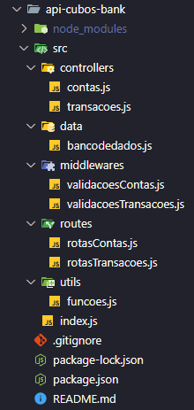
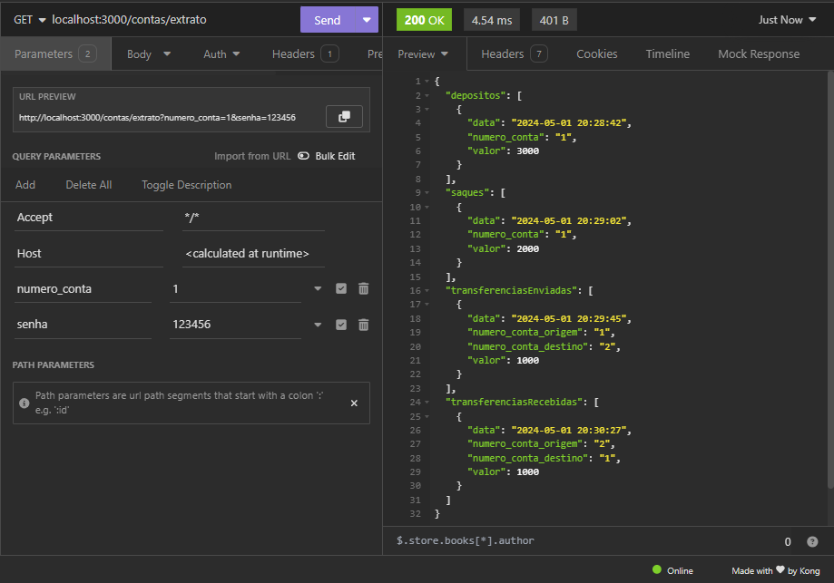
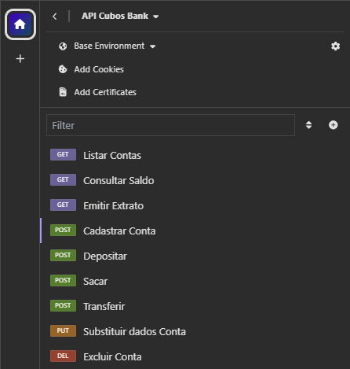

# :bank: API Cubos Bank :bank:

Bem vindos. Este é um projeto desenvolvido durante o Desafio Módulo 2 do curso de desenvolvimento de software Full Stack da [Cubos Academy](https://cubos.academy/cursos/desenvolvimento-de-software). Trata-se de um protótipo de API para banco digital. A API permite a criação e gestão de contas bancárias, incluindo operações como depósito, saque, transferência, consulta de saldo e emissão de extratos.

<u>É importante salientar que a API ainda não apresenta verificação de senha por criptografia, nem conexão com banco de dados. Estes recursos serão vistos nos próximos módulos do curso, assim, a API não os utiliza nesta versão, onde os dados ficam persistidos em memória.</u>


## 🔧 Como utilizar

Para a devida utilização desta API, siga as instruções abaixo:

#### 📋 Pré-requisitos

Antes de executar este projeto, certifique-se de que possui os seguintes pré-requisitos instalados e configurados em sua máquina:

- [Node.js](https://nodejs.org/en/download)

- [Git (opcional)](https://git-scm.com/downloads)

#### 📚 Dependências utilizadas

- [Express.js](https://www.npmjs.com/package/express) (para subir um servidor http localmente)
- [Nodemon](https://www.npmjs.com/package/nodemon) (para reiniciar automaticamente o servidor durante o desenvolvimento)
- [Date-fns](https://www.npmjs.com/package/date-fns) (para formatação de datas)

#### 💻  Executando o Projeto

1. Clone este repositório (caso você não possua o Git, você pode baixar o [arquivo ZIP](https://github.com/peucabral85/api-cubos-bank/archive/refs/heads/main.zip) do repositório e extrair).

```
git@github.com:peucabral85/api-cubos-bank.git
```

2. Acesse o projeto, abra o terminal e instale as dependências necessárias para o projeto utilizando npm.

```
npm install
```

3. Inicialize o servidor. O mesmo estará executando localmente e aceitando requisições na porta 3000.

```
npm run dev
```


## ⚙️ Estrutura do Projeto




## 🔩 Endpoints da API

**`GET /contas?senha_banco=Cubos123Bank`**

- Este endpoint lista todas as contas bancárias existentes.
- É utilizado um parâmetro tipo query informando a senha para liberação do acesso.

**`POST /contas`**

- Este endpoint cria uma conta bancária, onde será gerado um número único para identificação da conta (número da conta).

- A requisição é feita com um objeto Json, via body, informando os dados do usuário, de acordo com o exemplo abaixo:

```json
  {
  	"nome": "Miguel dos Anjos Santos",
  	"cpf": "70011122234",
  	"data_nascimento": "2000-03-15",
  	"telefone": "71999998888",
  	"email": "migueldanjos@gmail.com",
  	"senha": "123456"
  }
```

  

**`PUT /contas/:numeroConta/usuario`**

- Este endpoint atualiza apenas os dados do usuário de uma conta bancária.
- A requisição do número de conta a ser atualizada é feita como parâmetro URL e os dados a serem alterados são passados através de um objeto Json, no body da requisição, seguindo o mesmo modelo utilizado para criar conta.

**`DELETE /contas/:numeroConta`**

- Este endpoint exclui uma conta bancária existente, desde que não tenha saldo na conta.
- A requisição do número de conta a ser removida é feita como parâmetro URL.

**`POST /transacoes/depositar`**

- Este endpoint realiza um depósito em uma determinada conta bancária e registra a transação.
- A requisição é feita pelo body, através de um objeto Json contendo número da conta e valor no seguinte formato:

```json
{
	"numero_conta": "1",
	"valor": 3000
}
```

- O depósito fica registrado no array `depositos` inicializado no banco de dados da seguinte forma:

```json
{
	"data": "2024-05-01 16:58:35",
	"numero_conta": "1",
	"valor": 3000
}
```


**`POST /transacoes/sacar`**

- Este endpoint realiza um saque em uma determinada conta bancária e registra a transação.
- A requisição é feita pelo body, através de um objeto Json contendo número da conta, valor e senha do usuário no seguinte formato:

```json
{
	"numero_conta": "1",
	"valor": 2000,
        "senha": "123456"
}
```

- O saque fica registrado no array `saques` inicializado no banco de dados da seguinte forma:

```json
{
	"data": "2024-05-01 17:03:09",
	"numero_conta": "1",
	"valor": 2000
}
```


 **`POST /transacoes/transferir`**

- Este endpoint realiza uma transferência entre determinadas contas bancárias e registra a transação.
- A requisição é feita pelo body, através de um objeto Json contendo número da conta origem, número da conta destino, valor e senha da conta origem, no seguinte formato:

```json
{
	"numero_conta_origem": "1",
	"numero_conta_destino": "2",
	"valor": 1000,
	"senha": "123456"
}
```

- A transferência fica registrada no array `transferencias` inicializado no banco de dados da seguinte forma:

```json
{
	"data": "2024-05-01 17:07:48",
	"numero_conta_origem": "1",
	"numero_conta_destino": "2",
	"valor": 1000
}
```


 **`GET /contas/saldo?numero_conta={numero_conta}&senha={senha}`**

- Este endpoint consulta o saldo de uma determinada conta bancária.
- É utilizado um parâmetro tipo query informando número da conta e senha para liberação do acesso.

 **`GET /contas/extrato?numero_conta={numero_conta}&senha={senha}`**

- Este endpoint emite o extrato de uma determinada conta bancária.
- É utilizado um parâmetro tipo query informando número da conta e senha para liberação do acesso, onde o conteúdo retornado possui o seguinte formato:



## 🧪 Testes da API

Para testar a API use o [Insomnia](https://insomnia.rest/download) ou qualquer outro "testador de rotas" como o [Postman](https://www.postman.com/downloads/) ou o [Httpie](https://httpie.io/download), por exemplo.

Se você já utiliza o Insomnia, para maior comodidade,  é possível importar o arquivo `Insomnia_Testes` no Insomnia e as rotas já estarão criadas para teste do projeto. Caso utilize outro, verifique se há compatibilidade na importação.




## ⌨️ Ajustes e melhorias

O projeto poderá ter novos recursos e melhorias assim que os próximos módulos do curso forem sendo finalizados. Melhorias como:

- Autenticação das senhas por criptografia

- Persistência de dados em um banco de dados SQL ou NoSQL.

- Remoção de registro de saques, depósitos e transferências quando um usuário é excluído do banco de dados.

- Implementação de novas funcionalidades como validação de CPF, etc.

  

## 🤝Como contribuir com o Projeto

1. Faça um fork deste repositório.

2. Clone seu fork do projeto localmente.

3. Faça commit das suas alterações.

4. Faça push das alterações para o seu fork no GitHub.

5. Abra um pull request neste repositório.

   

## ✒️ Autor

* **Pericles C. Cabral** - *Projeto Curso Desenvolvimento de Software Full Stack M02* da [Cubos Academy](https://cubos.academy/)

<a href="https://www.linkedin.com/in/periclescabral" target="_blank"></a><a href = "https://github.com/peucabral85"></a>
